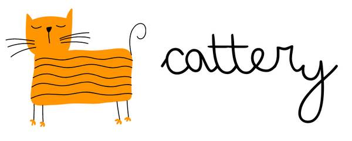

<p align="center"></p>

Decentralized Clubhouse on Near using GAN generated Dynamic NFTs and Akash Network for streaming

- [💻 Presentation Video](https://www.youtube.com/watch?v=fnpXPZ0y_Xk)
- [📖Devpost Submission](https://devpost.com/software/cattery)
- [⚡ Live Project](https://near-cattery.amanraj.dev)
- [☁️ Akash Backend](https://near-cattery.amanraj.dev/)
- [📃 Near Main NFT Contract](https://explorer.testnet.near.org/accounts/nftcontract.somenewname.testnet)
- [📃 WSK Token Contract](https://explorer.testnet.near.org/accounts/nfterc20contract.somenewname.testnet)
- [📃 NFT Pool Fraction Contract](https://explorer.testnet.near.org/accounts/nftnewcontract.somenewname.testnet)

### Genesis Wallet Mnemonic for Testing on Near
`duck crouch razor escape select brief prefer twist sport antique sunny property`

#### Inspiration

Make a decentralized clubhouse using Near X Akash and dynamically machine learning generated NFTs with Fractional NFT Membership model

#### Idea

Decentralized NFT Invite based creator membership model Fractionalization Pool of NFTs for audience membership Machine Learning based dynamically generated NFTs WSK NEP-141 tokens for staking to receive the NFTs Tokenomics.

We will have a limited supply of Whisker (WSK) NEP-141 tokens which any invitee will be asked to stake only then he will be eligible to receive an NFT from others.

Creating a Fractional pool for the NFTs to receive pool tokens to send to the audiences to make them join the room WSKs can be used to trade with these pool tokens.

#### User Acquisition Model

Velvet rope strategy and FOMO.

The clubhouse has over 10 million users and growing, let us say even if we are able to capture 10% of these users then we will be able to have 1 million users for the clubhouse.

We will make great use of something known as the "Velvet Rope strategy".

Velvet rope strategy means trying to create loyal customers out of the existing user base by creating exclusivity with services or product offerings.

In short, it's a way to add a level of scarcity and Fomo to any new offer.

What's next for Cattery
Gradually shifting from a chat room to a metaverse to enable users interact with each other.
Launch NFT marketplace to trade pool tokens with WSK

#### NFT Fractionalization

Create a pool from the NFT you have received.
Fractionalize your NFT by creating a pool.
Distribute the pool tokens to your audience to let them join your room.

#### How to set up?

Client setup:

```bash
cd client
# create and addd env variables
vim .env.local
# add variables
MONGO_URI=
MONGO_DB=
# start server
yarn
yarn run dev
```

Backend setup:

```bash
cd backend
# create and addd env variables
vim .env
# add variables
DB_USER=
DB_PASSWORD=
DB_URL=
DB_NAME=
# start server
docker build -t back .
docker run -p 80:80
```

---

### Team

- [ 👨🏻‍🎓 Arpit Srivastava](https://github.com/fuzious)
- [ 👨🏻‍💻 Aniket Dixit ](https://github.com/dixitaniket)
- [ 🌊 Aman Raj](https://amanraj.dev/)

---
